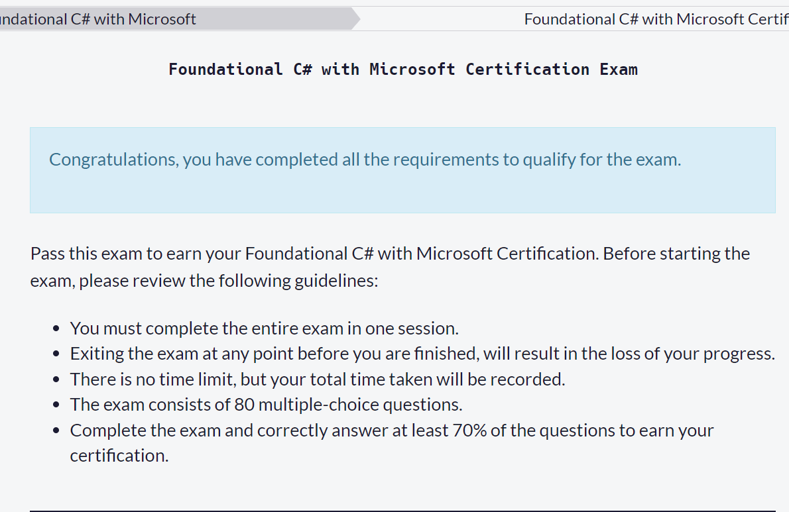

## Bismillah

C# Certification with freeCodeCamp Challenge

## Sumber belajar berikut ini:

1. https://www.freecodecamp.org/learn/foundational-c-sharp-with-microsoft/
2. https://code-maze.com/csharp-back-to-basics/

## Ujian




- Harus dikerjakan dalam 1 sessi tidak boleh berulang.
- Keluar dari Ujian sebelum selesai, nilai sebelumny akan hangus, gagal percuma.
- Tidak ada batasan waktu, tapi total waktu pengerjaan akan tercatat.
- Ujian terdiri dari 80 Pilihan ganda.
- Selesaikan ujian dan jawab dengan benar minimal 70% dari total pertanyaaan agar dapat Sertifikat.

## Hasil

### Test ke #1 (Failed)
```bash
Number of questions: 80
Correct answers: 49
Percent correct: 61.3%
Time: 36:00
```